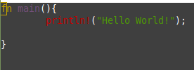
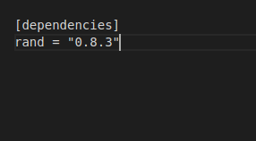
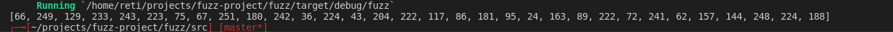
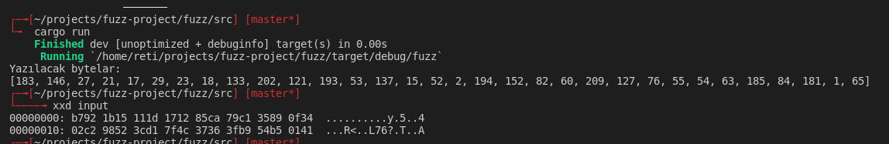
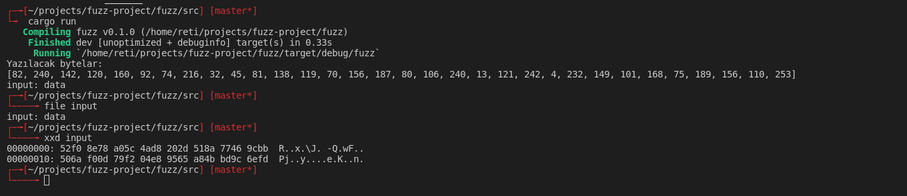

# Giriş
Bu yazı serisi (devamı gelir umarım) rust ile fuzzer yazma maceramdaki notlarımdan oluşmaktadır. İkisi hakkında da çok az bilgim olduğu için sıfırdan başlıyorum denebilir. Hedefim rust ile fuzzer (en azından basit işlemleri yapabilecek) yazmak. Ondan sonra [LibAFL'i](https://github.com/AFLplusplus/LibAFL) kurcalamak istiyorum. Bu yazı kesinlikle rust tutorialı değildir. Benim için bir konuyu öğrenmenin en iyi yolu uygulama yapmak olduğu için kafa göz daldım :)
# Referanslar
Referansları ilk başta koymamın sebebi bu yazının research projesinden ziyade kişisel notlarım olduğunu tekrardan vurgulamak istememdir. Aşağıdaki referanslarda benim textbooklarımdır.
-   [Fuzzing Book](https://www.fuzzingbook.org/)
-   [Fuzzing Like A Caveman](https://h0mbre.github.io/Fuzzing-Like-A-Caveman)
-   [Rust Book](https://doc.rust-lang.org/book/)

# İçerik
-   Fuzzing nedir? Ne değildir?
-   Niye Rust?
-   Rust kurulumu
-   İlk adımlar

# Fuzzing nedir? Ne değildir?

En basit tabiriyle fuzzing random inputlar vererek herhangi bir programın davranışını incelemektir. 1988'de Barton Miller üniversitede bulunan bilgisayarına bağlıyken, kötü hava koşulları sebebiyle bağlantıdaki gürültüden dolayı yazdığı komutlar crash olmaya başlamıştır. Barton, programları başka hangi şekilde crash edebiliriz diye düşünürken öğrencilerine **programın beklemediği** inputlar oluşturarak bunlarla programları çalıştıracakları bir ödev vermiştir. (Benden çok daha iyi anlatımı: https://www.fuzzingbook.org/html/Fuzzer.html#A-Testing-Assignment)

Bu başlangıçtan sonra çok fazla fuzzer ortaya çıkmaya başlamış. Bunların en bilinenleri AFL (AFL hakkında yazdığım eski bir yazı: https://blog.crypttech.com/2020/01/fuzzing-ve-afl.html), hongfuzz, peach ve radamsa olabilir. AFL ile birlikte code coverage mekanizması çok önem kazandı. Code coverage'ı kısaca açıklamak gerekirse verdiğimiz inputun hedef programda hangi satırları/blokları çalıştırdığını takip etmemize olanak sağlayan bir tooldur. AFL'in geliştirilmesi durduğu için şu durumda kullanmak tamamen kişinin keyfine kalmış. Ben [AFL++](https://github.com/AFLplusplus/LibAFL)'ı öneririm. AFL++, geliştirilmesi duran AFL'i temel alarak yeni özellikleriyle devam ediyor. Bunun yanı sıra AFL'in farklı forklarınıda kendi bünyesinde bulunduruyor. AFL'de afl-gcc ile derleme işlemleri yapılırken şimdi çok daha efektif olan afl-clang-lto gibi özellikler eklenmiştir. [Discord](https://discord.com/invite/psf5Wt5) kanalında çok yardımcı oluyorlar. Beni bazen saçma salak sorular sorarken görebilirsiniz :)

Fuzzing code auditing değildir. Vulnerability research alanı çok geniş olmakla beraber fuzzing bunun bir parçasıdır. Bütün zafiyetleri bulmak gibi bir garanti vermemekle beraber bazen elimiz boşta dönebiliriz. Fuzzerlar en iyi performansını bir dosyanın parse edildiği veya işlendiği programlarda göstermektedir.. Bunun dışındaki yerlerde **daha az efektif** olduğunu düşünüyorum.

Hikaye faslını anlatık. Yukarıda da okuduğunuz gibi fuzzer teknolojilerinde çok fazla aşama kaydedilmiş ve sadece random input üretmekten çok öteye gidilmiştir. Bunlar ilerinin konuları olmakla beraber giriş seviyesinde yapmamız gereken 2  (sonrasında sayı artacak) şey:
-   Random input üretmek.
-   Programa bu inputu verip çıktısına bakmak.

# Niye Rust?
Uzun süredir öğrenmek istediğim bir dil. Diğer sebepleri hakkında tonlarca şey yazılmış zaten. (https://learning-rust.github.io/docs/a1.why_rust.html)

# Rust Kurulumu

Rust kurmak aşırı basit. Aşağıdaki komutu çalıştırmadan https://www.rust-lang.org/tools/install adresinden kontrol edilmeli bence.

`curl --proto '=https' --tlsv1.2 -sSf https://sh.rustup.rs | sh ` 

Bu aşamada nasıl yüklemek istediğimizi soruyor. Ben default installation seçip devam ediyorum.


.

# İlk adımlar

İlk hello world örneği [buradakilerin](https://doc.rust-lang.org/book/ch01-02-hello-world.html) türkçeleştirilmiş halidir. Klasik haline gelmiş "Hello World!" yazdıralım.

```
mkdir fuzz
cd fuzz
mkdir hello_world
cd hello_world
nano main.rs
```

Görseldeki gibi yazıyoruz.



Derliyoruz. 

`rustc main.rs`

(`error: linking with `cc` failed: exit code: 1` hatası aldığımda `apt-get install libfreetype6-dev` ile libfreetype'ı yükleyince düzeldi.)


`./main` diyerek çalıştırdığımızda ise çıktımızı görüyoruz.


Hello World! yazısını gördükten sonra devam edebiliriz. Rustc ile devam edebiliriz ama cargo kullanarak ilerleyeceğim. Cargo rust'ın build ve paket yöneticisi diyebiliriz. (https://doc.rust-lang.org/book/ch01-03-hello-cargo.html)

```
cd ..
rm -rf hello_world
cargo init
```

Bunları çalıştırdıktan sonra rust'ın kendi yapısına uygun dosyalar gelicek. Rastgele sayı üretmek için rand kütüphanesini kullanmamız gerekmektedir. Cargo.toml dosyasının [dependencies]'ın altına rand = "0.8.3" yapıştırıyoruz.



Bundan sonraki kodları src klasörü altındaki main.rs'e yazıp `cargo run` ile çalıştırmayı düşünüyorum. Rastgele byte üretmeye başlayalım. Takip edilecek tutorial: https://rust-lang-nursery.github.io/rust-cookbook/algorithms/randomness.html

Rastgele sayı üreten kod aşağıdadır.

```
use rand::Rng;

fn main(){
    let mut rng = rand::thread_rng();

    let n1: u8 = rng.gen();
    let n2: u16 = rng.gen();
    println!("Rastgele u8 {}" , n1);
    println!("Ratgele u16 {}" , n2);
}
```

Bunu src/main.rs'e yazdıktan sonra `cargo build` ve `cargo run` diyerek çalıştırıyoruz.


Random byte üretmek içinde aynı fonksiyonu farklı bir şekilde çalıştırıcaz. (https://qertoip.medium.com/how-to-generate-an-array-of-random-bytes-in-rust-ccf742a1afd5)

```
//rand kütüphanesini ekliyoruz
use rand::Rng;


fn main(){

    //rand kütüphanesinin gen fonksiyonuyla 32 tane u8 tipinde değer üretiyoruz
    let random_bytes = rand::thread_rng().gen::<[u8; 32]>();
    // {:?} debugging için kullanılır
    println!("{:?}", random_bytes);
}
```
Çıktısı:



Random byteları ürettikten sonra bunları dosyaya yazalım. Bu dosyayı daha sonra input olarak fuzz edeceğimiz programa vereceğiz. Elimden geldiğince yorum yazmaya çalışıyorum kodlara. (https://stackoverflow.com/questions/53826371/how-to-create-a-binary-file-with-rust/53827079)

```
//rand kütüphanesini ekliyoruz
use rand::Rng;

//std kütüphanesi diğer dillerdekiyle aynı

use std::io::Write;

fn main(){

    //rand kütüphanesinin gen fonksiyonuyla 32 tane u8 tipinde değer üretiyoruz
    let random_bytes = rand::thread_rng().gen::<[u8; 32]>();
    println!("Yazılacak bytelar:");
    println!("{:?}", random_bytes);
    //dosya açıyoruz
    let mut file = std::fs::File::create("input").expect("create failed");
    //byte array'i dosyaya yazıyoruz.
    file.write_all(&random_bytes).expect("write failes");
    
}
```

Gerçekten düzgünce yazıyor mu diye kontrol ettiğimizde sorun olmadığını görüyoruz. Değerleri decimal olarak bastırıp byte olarak yazdığım için hexadecimal karşılıkları yazılıyor. Bizimde istediğimiz bu zaten.



Gerçekten doğru mu yazdığından emin olmak için kontrol ediyoruz.


Bu noktadan sonra input adında bir dosyanın oluşması gerekiyor. Şimdi rust ile komut çalıştırmayı deneyelim. Bunu yapmamızın nedeni bundan sonraki adımda fuzz edeceğimiz komutu istediğimiz inputla çalıştırmak.
```
//rand kütüphanesini ekliyoruz
use rand::Rng;
//std kütüphanesi diğer dillerdekiyle aynı
use std::io::{self, Write};
//komut çalıştırmak için process::Command'ı ekliyoruz
use std::process::Command;


fn main(){

    //rand kütüphanesinin gen fonksiyonuyla 32 tane u8 tipinde değer üretiyoruz
    let random_bytes = rand::thread_rng().gen::<[u8; 32]>();
    println!("Yazılacak bytelar:");
    println!("{:?}", random_bytes);

    //dosya açıyoruz.https://stackoverflow.com/questions/53826371/how-to-create-a-binary-file-with-rust/53827079
    let mut file = std::fs::File::create("input").expect("create failed");

    //byte array'i dosyaya yazıyoruz.
    file.write_all(&random_bytes).expect("write failes");

    //File komutunu çalıştırıp oluşturduğumuz dosyayı argüman olarak veriyoruz.
    let output = Command::new("file").arg("input").output().expect("failed to execute");
    io::stdout().write_all(&output.stdout).unwrap();

}
```



Düzgün çalıştığından emin olduktan sonra bunu 10 kere dönen bir for döngüsüne koyup aptal ama çalışan ilk fuzzerımızı yazmış olalım. For döngüsünü istediğiniz kere çalıştırıp bütün elemanları rastgele olan inputlarla fuzz edebilirsiniz.
```
//rand kütüphanesini ekliyoruz
use rand::Rng;
//std kütüphanesi diğer dillerdekiyle aynı
use std::io::{self, Write};
//komut çalıştırmak için process::Command'ı ekliyoruz
use std::process::Command;


fn main(){

    // 10 kere dönen for loop
    for number in 1..11 {    
    //rand kütüphanesinin gen fonksiyonuyla 32 tane u8 tipinde değer üretiyoruz
    let random_bytes = rand::thread_rng().gen::<[u8; 32]>();
    println!("Yazılacak bytelar:");
    println!("{:?}", random_bytes);

    //dosya açıyoruz.https://stackoverflow.com/questions/53826371/how-to-create-a-binary-file-with-rust/53827079
    let mut file = std::fs::File::create("input").expect("create failed");

    //byte array'i dosyaya yazıyoruz.
    file.write_all(&random_bytes).expect("write failes");

    //File komutunu çalıştırıp oluşturduğumuz dosyayı argüman olarak veriyoruz.
    let output = Command::new("file").arg("input").output().expect("failed to execute");
    io::stdout().write_all(&output.stdout).unwrap();


    }
}
`````

Buraya kadar okuduğunuz için teşekkür ederim. İkinci yazı büyük ihtimalle mutasyon stratejileri hakkında olur. Görüş/hata bildirmek isterseniz bana [twitter'dan](https://twitter.com/Burakcarikci) ulaşabilirsiniz.
