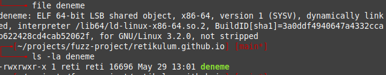
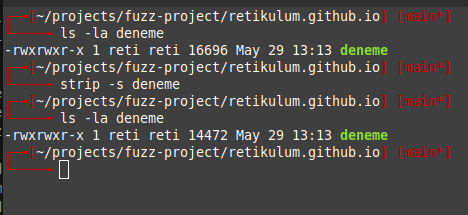
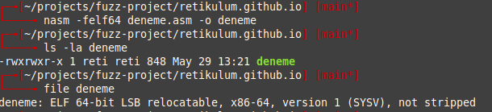
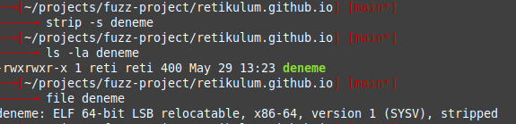
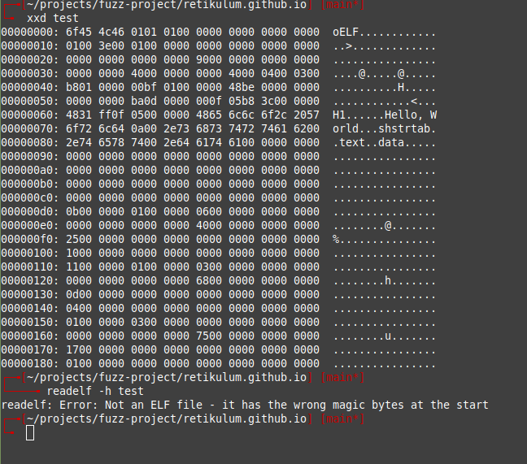
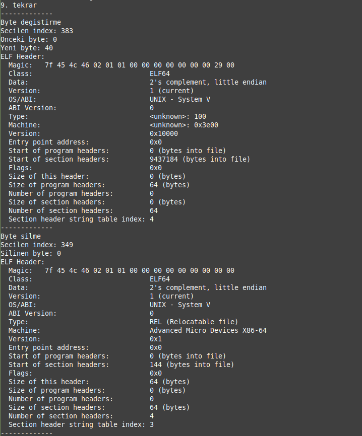

# Rust ile Fuzzer Yazıyorum 2

## Giriş
İlk yazıda fuzzing konseptine küçük bir giriş yapmıştık. Bu yazıda ise daha çok fuzzingin önemli bir parçası olan mutasyonlar üzerinde konuşacağız. Bu yazı serisi tutorialdan ziyade kendi çalışmalarımdan aldığım notlardır.

## Referanlar
Rust ve fuzzer konusunu sıfırdan öğrendiğim için bu yazıda hatalar olabilir. Kullandığım referanslar aşağıdadır:

-   [Fuzzing Book](https://www.fuzzingbook.org/)
-   [Fuzzing Like A Caveman](https://h0mbre.github.io/Fuzzing-Like-A-Caveman)
-   [Rust Book](https://doc.rust-lang.org/book/)

## İçerik
-   Mutasyon nedir?
-   Mutasyon Tipleri
-   Az Akıllı Fuzzer
-   İmplementasyon

## Mutasyon Nedir?

TDK'da mutasyon diye arattığımda değişinim sonucu çıktı. Değişinim kelimesini arattığımda ise **genlerde veya kromozomlarda oluşan hasara bağlı olarak ortaya çıkan ve sonraki kuşağa aktarılabilen kalıcı hücresel değişiklik, mutasyon** olarak tanımlanmaktadır. En basit tabiriyle genlerimizin dış bir etken sonucu değişmesi diyebiliriz. Az biyoloji bilgimle bir örnek vereyim. CGT-CGC-CGA_GGG (Arjinin) şeklinde bir DNA dizilimimiz varsa ve buradaki CGC üçlüsü CGA olursa bu arjinin proteininin salgılanması durur. (https://www.thoughtco.com/gene-mutation-373289)

Şimdi bunları niye anlattık? Bizde fuzzer yazarken (diğer bütün fuzzerlar gibi) yeni inputlar üretmemiz lazım. Bu inputları gelişigüzel üretmek yerine elimizdeki dosya formatının veya herhangi bir inputun (http isteği, network trafiği vs) içerisindeki bytelara mutasyon uygulayıp yeni inputlar elde edeceğiz. Yukarıdaki örnekte düzgün çalışan bir gen diziliminin tek bir molekülünü değiştirdiğimizde vücudumuzun **normalden farklı** çalıştığını gördük. Bizimde istediğimiz tam olarak bu olduğu için mutasyonlarla fuzz ettiğimiz programın crash etmesini (tabikide vücüdumuzun crash etmesini istemiyoruz) veya farklı davranmasını bekliyoruz.

## Mutasyon Tipleri

Biyolojideki mutasyon tiplerini aşağıda görebilirsiniz.


Bizim bu yazıda işleyeceğimiz mutasyon tipleri aşağıdaki gibidir:
-   Byte değiştirme
-   Byte silme
-   Byte tekrarlama
-   Byte eklemek

## Az Akıllı Fuzzer

Günümüzde her şeye akıllı sıfatı vermeye başladık. Fuzzerlarda aslında ilk çıktıları günlere göre çok daha akıllı diyebiliriz. Fuzzerın aklını ise yapılan mutasyona göre hedef programda ne kadar farklı satır/bloğa dokunduğumuz (3. yazının konusu olacak) olarak tanımlayabiliriz.

Bu yazıda elf dosya formatını inceleyip readelf komutuna -- çok fazla fuzz edildiği için crash bulamayız büyük ihtimalle ama konsepti öğrenmek önemli :) -- mutasyon sonucu oluşturduğumuz inputlarla fuzz edelim.

readelf komutu elf dosyaları hakkında bilgi vermektedir. Bizde çok basit bir elf dosyası oluşturarak bunu inceleyip mutasyonlarımızı yapacağız. C ile basit bir hello world programı yazıp bunu compile edip çıktısına bakalım.

```
#include <stdio.h>
int main(){

printf("Hello world");
return 0;
}
```

Aşağıdaki gibi derliyoruz.

`gcc deneme.c -o deneme`

En basit şekilde derlediğimiz dosyanın özelliklerine bakıyoruz.



Sadece "Hello World" bastırdığımız bir dosyaya göre baya büyük gözüküyor. Mutasyonları bu dosya üzerinden yapmamız bize çok zaman kazandıracağı için daha da küçültmemiz gerekiyor. Buradaki **not stripped** ifadesi bize debug sembollerinin dosyanın içerisinde olduğunu gösteriyor. Bunu kaldıralım:



Dosyamız çok küçülmediği için **ancient art** olan assembly'e başvuralım. https://cs.lmu.edu/~ray/notes/nasmtutorial)

```
          global    _start

          section   .text
_start:   mov       rax, 1                  ; write sistem çağrısı
          mov       rdi, 1                  ; 1 = stdout
          mov       rsi, message            ; bufferın adresi
          mov       rdx, 13                 ; kaç byte yazdığım
          syscall                           ; sistem çağrısını çağırıyoruz
          mov       rax, 60                 ; exit sistem çağrısı
          xor       rdi, rdi                ; exit code 0
          syscall                           ; sistem çağrısını çağırıyoruz

          section   .data
message:  db        "Hello, World", 10      ; Stringimiz

```

Compile edip dosyanın özelliklerine bakıyoruz.



Not-stripped yazısı dikkatimizi çekiyor ve gerekeni yapıyoruz.




16696'dan 400'e iyi aşama kaydettiğimizi düşünüyorum. Boyutu daha çok azaltmanın başka yolları var (http://timelessname.com/elfbin/) fakat konudan çok sapmamak için devam ediyorum. ELF dosyaları "7f454c4" yani 0x7F 'E' 'L' 'F' header'ı ile başlamaktadır. Bu da zaten ELF'i tanımlayan [magic byte'tır](https://www.netspi.com/blog/technical/web-application-penetration-testing/magic-bytes-identifying-common-file-formats-at-a-glance/). Hemen test edelim. 



Yukarıda da görüldüğü gibi 0x7F'i 0x6F yapınca readelf yanlış magic byte verdin bana diye hata verdi. Bu bize uygulayacağımız mutasyonların magic byte dışındaki diğer bytelara (şimdilik) uygulamamız gerektiğini söylüyor. Bundan dolayı bu yazıda yazacağımız fuzzera  az akıllı fuzzer dedim.

## İmplementasyon

Neler yapmamız gerektiğini kurguladık. Şimdi rust ile bunu yazmaya dalalım. Dosyamızı açalım. Burası geçen haftayla aynı ama "{:?}" ile bastırdığımızda decimal olarak bastırıp python ile kontrolünü yapmıştık. Dökümantasyonu okurken "{:x?}" ile hexadecimal olarak bastırabileceğimi farkettim. Hem onuda göstermek istedim.
```
//gerekli kütüphaneleri çağıralım.
use std::fs::File;
use std::io::Read;

fn main()
{
    //dosyayı açalım
    let mut file=File::open("deneme").expect("Reading error");
    let mut buf_ref: Vec<u8>= Vec::new();
    let metadata = metadata("deneme").expect("unable to read metadata");
    let mut buf = vec![0; metadata.len() as usize];
    file.read(&mut buf).unwrap();
    buf_ref = buf.clone();
    file.read(&mut buf).unwrap();
    //ilk yazıda decimal olarak bastırıyorduk ve kontrolünü python ile yapmıştık
    //dökümantasyon okurken {:x?} ile hex olarak bastırabileceğimizi farkettim
    println!("{:x?}",buf);
```

Mutasyon işlemini hangi index'e yapmamız gerektiğine karar vermek için random sayı seçmemiz gerekiyor. Magic byte'a dokunmadan (ilk 4 byte) diğerleri arasından bir index seçmemiz gerekmektedir. Bunun için aşağıdaki fonksiyonu kullanacağız.

`rand::thread_rng().gen_range(4..400);`

Şimdi mutasyon stratejilerimizi teker teker implement edelim. Byte değiştirme fonksiyonunda 4-400 aralığı arasında rastgele bir index seçip, 0-255 arasında ürettiğimiz bir byte'ı seçilen indexle değiştiriyor.

```
fn change_byte(buf_ref :&mut Vec<u8>) {
    println!("Byte degistirme");
    let random_index = rand::thread_rng().gen_range(4..400);
    println!("Secilen index: {:?}",random_index);
    let random_byte = rand::thread_rng().gen_range(0..255);
    println!("Onceki byte: {:x?}", buf_ref[random_index]);
    println!("Yeni byte: {:x?}", random_byte);
    buf_ref[random_index] = random_byte; 
}
```
Byte silme işleminde 4-400 aralığı arasında random bir index seçilip o byte siliniyor.
```
fn delete_byte(buf_ref : &mut Vec<u8>)  {
    println!("Byte silme");
    let random_index = and::thread_rng().gen_range(4..400);
    println!("Secilen index: {:?}",random_index);
    println!("Silinen byte: {:x}", buf_ref[random_index]);
    buf_ref.remove(random_index);
}
```

Byte tekrarlama işleminde 4-400 aralığı arasında random bir index seçilip o byte bir sonraki byte olacak şekilde yazılıyor.
```
fn duplicate_byte(buf_ref : &mut Vec<u8>){
    println!("Byte tekrarlama");
    let random_index = rand::thread_rng().gen_range(4..400);
    println!("Secilen index: {:?}", random_index);
    let inserted_byte = buf_ref[random_index];
    println!("Eklenen byte: {:x?}", inserted_byte);
    buf_ref.insert(random_index,inserted_byte);
}
```
Byte ekleme işleminde 4-400 aralığı arasında random bir index seçip, 0-255 aralığından ürettiğimiz byte'ı seçilen indexe yazıyor.

```
fn insert_byte(buf_ref: &mut Vec<u8>){
    println!("Byte ekleme");
    let random_index = rand::thread_rng().gen_range(4..400);
    println!("Secilen index: {:?}", random_index);
    let inserted_byte = rand::thread_rng().gen_range(0..255);
    println!("Eklenen byte: {:x?}", inserted_byte);
    buf_ref.insert(random_index, inserted_byte);
}
```

Bu yazı kapsamında bulunan bütün mutasyon türlerini implemente ettikten sonra ilk yazıdakine benzer bir şekilde 10 kere dönen bir for loop'un içerisine her mutasyon her döngüde 1 kez olacak şekilde yazalım. Fuzzerımızın son hali aşağıdaki gibi oldu. Kod tekrarlarını daha iyi anlamam için yaptım. Rust ve kod yazma standartlarını öğrendikçe daha güzel olacağına inanıyorum. Kodun içerisine elimden geldiği kadar çok bilgiyi ekrana bastırması için printler koydum. Son hali:

```
//dosya açmak için gereken kütüphane
use std::fs::File;
use std::fs::metadata;
//dosya okumak için gereken kütüphane
use std::io::Read;
use std::io::{self, Write};
//random kütüphanesi
use rand::Rng;

use std::process::Command;


fn main()
{
    //dosyayı açalım
    //bu sefer Vec<u8> kullanıyoruz. Diğer dillerdeki vektöre benziyor
    //işlem kolaylığı sağlıyor
    let mut file=File::open("deneme").expect("Reading error");
    let mut buf_ref: Vec<u8>= Vec::new();
    let metadata = metadata("deneme").expect("unable to read metadata");
    let mut buf = vec![0; metadata.len() as usize];
    file.read(&mut buf).unwrap();
    buf_ref = buf.clone();
    
    //10 kere dönen for loop
    //buradaki kod tekrarları neler yapıldığının daha iyi görülmesi içindir
    for number in 1..11{
        println!("{:}. tekrar", number);
        println!("-------------");
        let mut file = std::fs::File::create("input").expect("create failed");
        change_byte(&mut buf_ref);
        file.write_all(&buf_ref).expect("write failes");
        let output = Command::new("readelf").arg("-h").arg("input").output().expect("failed to execute");
        io::stdout().write_all(&output.stdout).unwrap();
        buf_ref = buf.clone();
        println!("-------------");

        let mut file = std::fs::File::create("input").expect("create failed");
        delete_byte(&mut buf_ref);
        file.write_all(&buf_ref).expect("write failes");
        let output = Command::new("readelf").arg("-h").arg("input").output().expect("failed to execute");
        io::stdout().write_all(&output.stdout).unwrap();
        buf_ref = buf.clone();
        println!("-------------");

        let mut file = std::fs::File::create("input").expect("create failed");
        duplicate_byte(&mut buf_ref);
        file.write_all(&buf_ref).expect("write failes");
        let output = Command::new("readelf").arg("-h").arg("input").output().expect("failed to execute");
        io::stdout().write_all(&output.stdout).unwrap();
        buf_ref.clone();
        println!("-------------");

        let mut file = std::fs::File::create("input").expect("create failed");
        insert_byte(&mut buf_ref);
        file.write_all(&buf_ref).expect("write failes");
        let output = Command::new("readelf").arg("-h").arg("input").output().expect("failed to execute");
        io::stdout().write_all(&output.stdout).unwrap();
        buf_ref.clone();    
    }
    
}

fn change_byte(buf_ref :&mut Vec<u8>) {
    println!("Byte degistirme");
    let random_index = rand::thread_rng().gen_range(4..400);
    println!("Secilen index: {:?}",random_index);
    let random_byte = rand::thread_rng().gen_range(0..255);
    println!("Onceki byte: {:x?}", buf_ref[random_index]);
    println!("Yeni byte: {:x?}", random_byte);
    buf_ref[random_index] = random_byte; 
}

fn delete_byte(buf_ref : &mut Vec<u8>)  {
    println!("Byte silme");
    let random_index = rand::thread_rng().gen_range(4..400);
    println!("Secilen index: {:?}",random_index);
    println!("Silinen byte: {:x}", buf_ref[random_index]);
    buf_ref.remove(random_index);
}

fn duplicate_byte(buf_ref : &mut Vec<u8>){
    println!("Byte tekrarlama");
    let random_index = rand::thread_rng().gen_range(4..400);
    println!("Secilen index: {:?}", random_index);
    let inserted_byte = buf_ref[random_index];
    println!("Eklenen byte: {:x?}", inserted_byte);
    buf_ref.insert(random_index,inserted_byte);
}

fn insert_byte(buf_ref: &mut Vec<u8>){
    println!("Byte ekleme");
    let random_index = rand::thread_rng().gen_range(4..400);
    println!("Secilen index: {:?}", random_index);
    let inserted_byte = rand::thread_rng().gen_range(0..255);
    println!("Eklenen byte: {:x?}", inserted_byte);
    buf_ref.insert(random_index, inserted_byte);

}
```

Kodu çalıştırdığımızda biraz uzun bir çıktısı oluyor. Çalışıp çalışmadığını anlamak için readelf çıktılarında farklı bir şey var mı diye bakıyorum. Her çalışmasında random olduğu için sizin çıktınızla benimki farklı olacaktır. Bende 9.tekrarda **start of section headers** kısmının diğerlerinden farklı olduğunu görüyorum. Yaptığımız mutasyonlar yanıt verdi ve bazı şeyleri değiştirip readelf'i fuzz etmeye (basitçe) başladık.




Buraya kadar okuduğunuz için çok teşekkür ederim.Üçüncü yazıyı code coverage hakkında yazmayı düşünüyorum. Görüş/hata (özelllikle rust yazım şekli ve fuzzing ile ilgili) bildirmek isterseniz [twitter'dan](https://twitter.com/Burakcarikci) bana ulaşabilirsiniz.
